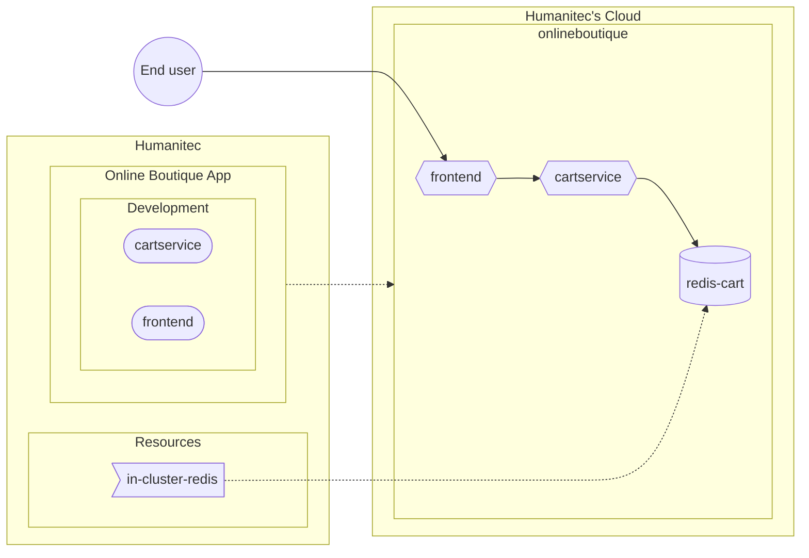

<p align="center">

</p>

[](https://github.com/Humanitec-DemoOrg/onlineboutique-demo/actions/workflows/ci.yaml)

Repository containing all the resources to deploy the [Online Boutique sample apps](https://github.com/GoogleCloudPlatform/microservices-demo) with Score and Humanitec.

Deploying the Online Boutique sample apps in Humanitec consists in 4 main steps:
- [Create the Online Boutique App](#create-the-online-boutique-app)
- [Configure an in-cluster Redis database](#configure-an-in-cluster-redis-database)
- [Deploy the Online Boutique Workloads](#deploy-the-online-boutique-workloads)
- [Enjoy!](#test-the-online-boutique-website)

As next steps, [there is more if you want](docs/README.md)! ;)



```bash
export HUMANITEC_TOKEN=FIXME
export HUMANITEC_ORG=FIXME
export HUMANITEC_CONTEXT=/orgs/${HUMANITEC_ORG}
```

## Create the Online Boutique App

As Platform Admin, in Humanitec.

```bash
ONLINEBOUTIQUE_APP=onlineboutique
humctl create app ${ONLINEBOUTIQUE_APP} \
    --name ${ONLINEBOUTIQUE_APP}
```

```bash
ENVIRONMENT=development
```

## Configure an in-cluster Redis database

As Platform Admin, in Humanitec.

```bash
humctl create \
    -f resources/in-cluster-redis.yaml
```

## Deploy the Online Boutique Workloads

As Developer, in Humanitec.

### All in once

```bash
FIRST_WORKLOAD="adservice"
COMBINED_DELTA=$(score-humanitec delta \
    --app ${ONLINEBOUTIQUE_APP} \
    --env ${ENVIRONMENT} \
    --org ${HUMANITEC_ORG} \
    --token ${HUMANITEC_TOKEN} \
    --retry \
    -f apps/${FIRST_WORKLOAD}/score.yaml \
    --extensions apps/${FIRST_WORKLOAD}/humanitec.score.yaml \
    | jq -r .id)
WORKLOADS="cartservice checkoutservice currencyservice emailservice frontend loadgenerator paymentservice productcatalogservice recommendationservice shippingservice"
for w in ${WORKLOADS}; \
do \
    COMBINED_DELTA=$(score-humanitec delta \
        --app ${ONLINEBOUTIQUE_APP} \
        --env ${ENVIRONMENT} \
        --org ${HUMANITEC_ORG} \
        --token ${HUMANITEC_TOKEN} \
        --delta ${COMBINED_DELTA} \
        --retry \
        -f apps/$w/score.yaml \
        --extensions apps/$w/humanitec.score.yaml \
        | jq -r .id); \
done
humctl deploy delta ${COMBINED_DELTA} ${ENVIRONMENT} \
    --context ${HUMANITEC_CONTEXT}/apps/${ONLINEBOUTIQUE_APP}
```
_Note: `loadgenerator` is deployed to generate both: traffic on these apps and data in the database. If you don't want this, feel free to remove it from the above list of `WORKLOADS`._

### One by one

```bash
WORKLOAD=adservice #cartservice checkoutservice currencyservice emailservice frontend loadgenerator paymentservice productcatalogservice recommendationservice shippingservice
score-humanitec delta \
	--app ${ONLINEBOUTIQUE_APP} \
	--env ${ENVIRONMENT} \
	--org ${HUMANITEC_ORG} \
	--token ${HUMANITEC_TOKEN} \
	--deploy \
	--retry \
	-f apps/${WORKLOAD}/score.yaml \
	--extensions apps/${WORKLOAD}/humanitec.score.yaml
```

## Test the Online Boutique website

Get the public DNS exposing the `frontend` Workload:
```bash
humctl get active-resources \
	--context ${HUMANITEC_CONTEXT}/apps/${ONLINEBOUTIQUE_APP}/envs/${ENVIRONMENT} \
	-o json \
	| jq -c '.[] | select(.object.type | contains("dns"))' \
	| jq -r .object.resource.host
```
