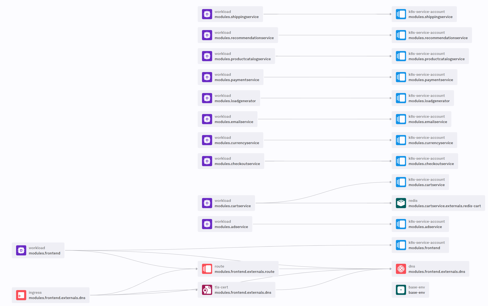

Get the [GoogleCloudPlatform/microservices-demo](https://github.com/GoogleCloudPlatform/microservices-demo) to Score and Humanitec.

This repository has been illustrated with this blog post: [Platform Engineering in action: Deploy the Online Boutique sample apps with Score and Humanitec](https://medium.com/p/d99101001e69).


## Local deployment

You will need to [install `score-compose`](https://docs.score.dev/docs/score-implementation/score-compose/) locally.

Deploy locally:
```bash
make compose-up
```

Get the generated DNS once the deployment is done:
```bash
score-compose resources get-outputs dns.default#frontend.dns --format '{{ .host }}:8080'
```

## Humanitec deployment

You will need to [install `humctl`](https://developer.humanitec.com/platform-orchestrator/cli/) locally.

Deploy to Humanitec:
```bash
export HUMANITEC_ORG=FIXME
export HUMANITEC_APPLICATION=onlineboutique
export HUMANITEC_ENVIRONMENT=development

humctl login

humctl create app ${HUMANITEC_APPLICATION} \
    --name ${HUMANITEC_APPLICATION}

humctl apply \
    -f resources/in-cluster-redis.yaml

make humanitec-deploy
```

Get the generated DNS once the deployment is done:
```bash
humctl get active-resources \
    --app ${HUMANITEC_APPLICATION} \
    --env ${HUMANITEC_ENVIRONMENT} \
    -o json \
    | jq -c '.[] | select(.metadata.type | contains("dns"))' \
    | jq -r .status.resource.host
```

Here is the associated resource graph generated by Humanitec:
```bash
humctl resources graph \
    --app ${HUMANITEC_APPLICATION} \
    --env ${HUMANITEC_ENVIRONMENT}
```



More:
- [Point `cartservice` to an existing Memorystore (Redis) database](docs/static-memorystore.md)
- [Point `cartservice` to a Memorystore (Redis) database dynamicly provisioned](docs/dynamic-memorystore.md)
