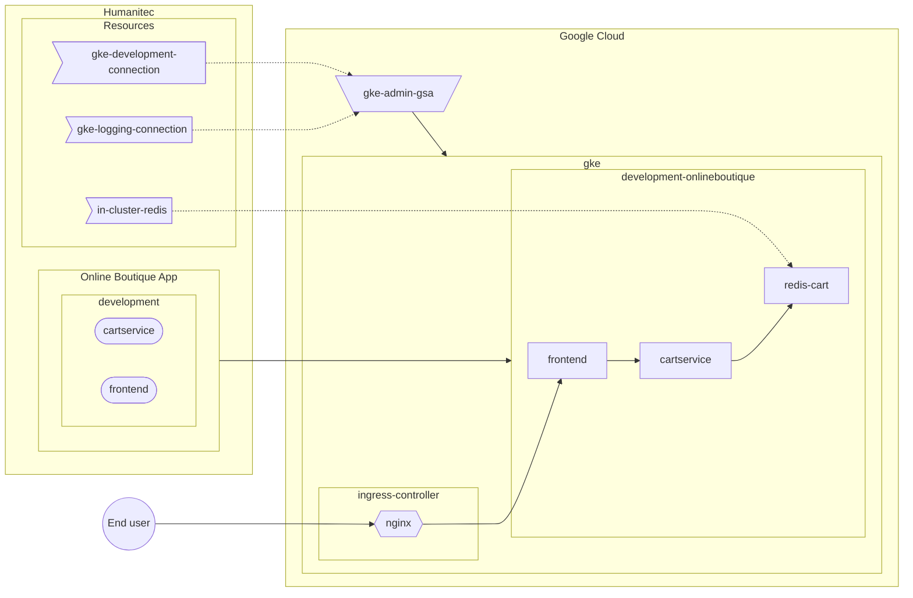
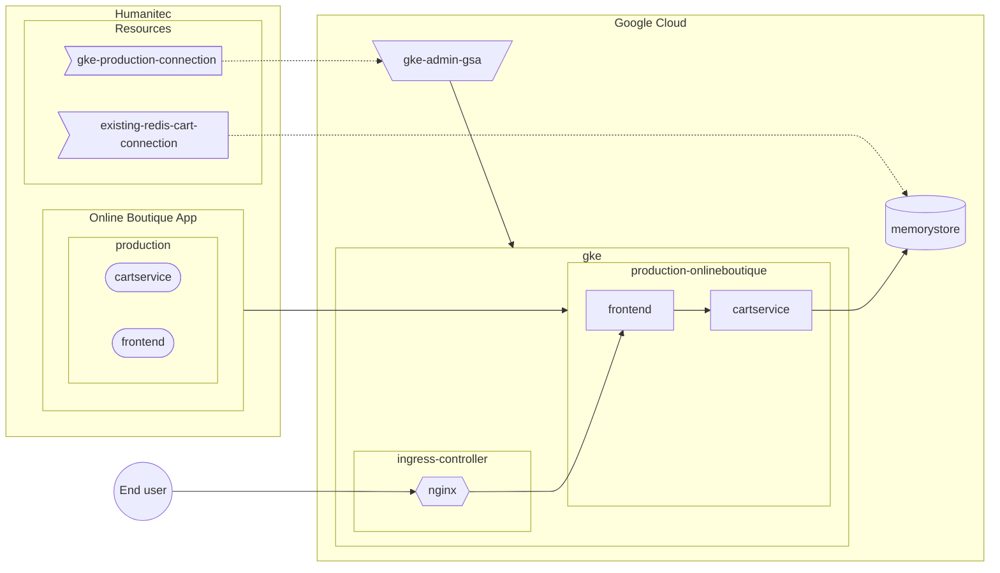

## Common Namespaces and Deployments

- [Customize the `securityContext` of the Deployments](custom-workload.md)
- [Customize the name of the Namespace and add PSS label](custom-namespace.md)

## Google Cloud - GKE

- [Bring your own GKE cluster](byo-gke.md)
- [Bring your own Google Cloud Logging](byo-gcp-logging.md)

- [Bring your own Memorystore (Redis) instance](byo-memorystore.md)